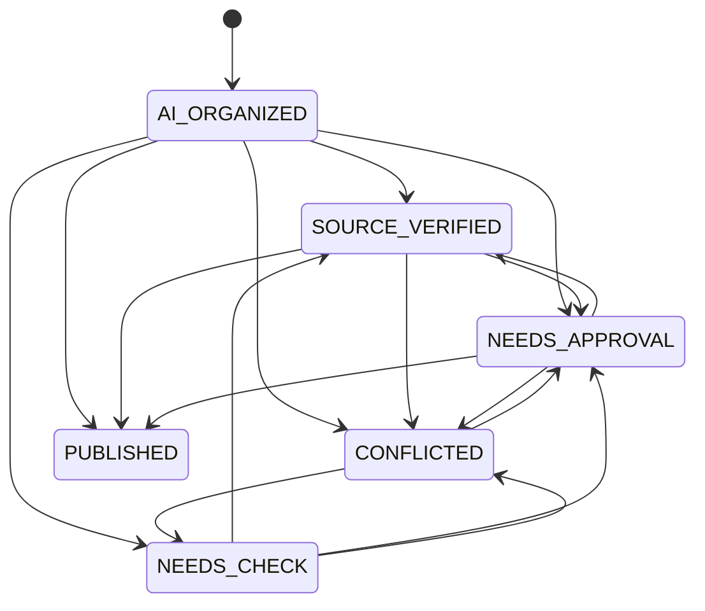

# Candidate State Machine Contract

> PR-26 contract. This document fixes the shared vocabulary for PR-27 through PR-35.

## Purpose

Knowledge candidates are not always official knowledge. Every source first becomes a candidate, then WekiFlow decides whether it can be published automatically, needs source confirmation, needs human approval, or conflicts with existing official knowledge.

The code contract lives in `packages/shared/src/candidate.ts`.

## Candidate Statuses

| Code | User-facing label | Meaning | Default document projection |
| :--- | :--- | :--- | :--- |
| `AI_ORGANIZED` | AI 정리됨 | AI read a source and organized a draft candidate. | `DRAFT` |
| `SOURCE_VERIFIED` | 출처 확인됨 | Claims are connected to a file, URL, datasource record, or other source reference. | `REVIEW` |
| `NEEDS_CHECK` | 확인 필요 | Source context is weak, missing, or conversation-based. | `REVIEW` |
| `NEEDS_APPROVAL` | 승인 필요 | The candidate is high-risk and requires an approver before official use. | `REVIEW` |
| `PUBLISHED` | 공식 지식 | The candidate passed approval or the auto-publish contract. | `PUBLISHED` |
| `CONFLICTED` | 충돌 있음 | The candidate may contradict existing official knowledge. | `REVIEW` |

Existing document statuses project back to candidate statuses as follows:

| Document status | Candidate status |
| :--- | :--- |
| `DRAFT` | `AI_ORGANIZED` |
| `PROCESSING` | `AI_ORGANIZED` |
| `PREVIEW` | `AI_ORGANIZED` |
| `REVIEW` | `NEEDS_APPROVAL` |
| `PUBLISHED` | `PUBLISHED` |
| `GRAPH_INDEXED` | `PUBLISHED` |
| `FAILED` | `NEEDS_CHECK` |

## Transitions

`PUBLISHED` is terminal in this contract. Published updates must go through curation or a later explicit revision contract.

## Risk Factors

Any risk factor makes `needsReview(candidate)` return `true`.

| Risk factor | Review reason |
| :--- | :--- |
| `policy` | Policy wording can become official guidance. |
| `regulation` | Legal or regulatory content needs approval. |
| `contract` | Contract terms affect commitments. |
| `security` | Security statements can expose risk. |
| `pricing` | Pricing changes affect customers or sales commitments. |
| `official_answer` | Candidate may be reused as an official answer. |
| `no_source` | Claims are not tied to a source. |
| `conflict` | Candidate may contradict published knowledge. |
| `external_exposure` | Content may be visible outside the internal workspace. |

## Provenance

`CandidateProvenance.kind` is one of:

| Kind | Source |
| :--- | :--- |
| `file` | Uploaded or local file source. |
| `url` | Web URL source. |
| `datasource` | Connector or structured datasource source. |
| `conversation` | Chat, meeting, or user conversation source. |
| `manual` | User-created manual input. |

Conversation provenance may include `conversationQuote`, `speaker`, `createdFromConversation`, and `needsSource`. If `kind` is `conversation`, the shared schema defaults `createdFromConversation=true`, `needsSource=true`, and the default candidate status is `NEEDS_CHECK`.

## Auto-Publish

`canAutoPublish(candidate)` returns `true` only when:

- `needsReview(candidate)` is `false`
- status is `AI_ORGANIZED` or `SOURCE_VERIFIED`
- provenance kind is not `conversation`

Conversation-based candidates never auto-publish under this contract, even when no risk factor is present. They must first be connected to a stronger source or approved by the appropriate reviewer.
