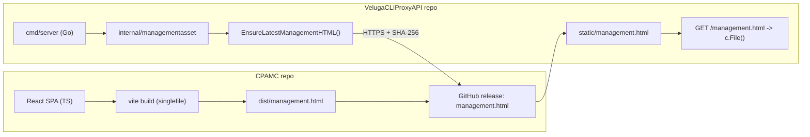
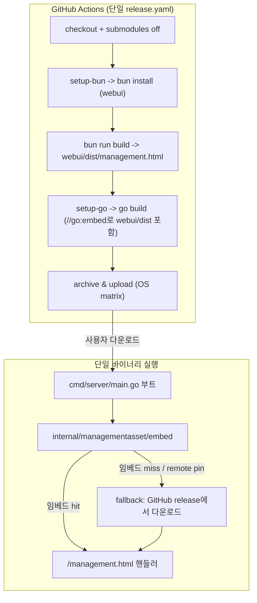

# VelugaCLIProxyAPI + Cli-Proxy-API-Management-Center 통합 구현 계획

> **목표**: `D:\dev\VelugaCLIProxyAPI` 아래에 별도 서브모듈로 들어 있는 `Cli-Proxy-API-Management-Center-main`(React/Vite Web UI)을 메인 Go 프로젝트(`VelugaCLIProxyAPI`)와 **하나의 모노레포**로 통합한다.
>
> 최종 산출물은 "Go 서버 + Web UI를 단일 release로 함께 빌드·배포하는 단일 저장소"이며, 서버 바이너리 하나에 `management.html`이 임베드되어 추가 다운로드 없이 즉시 서빙되는 것이 최종 상태다.

---

## 1. 현재 상태 분석 (AS-IS)

### 1-1. 두 저장소의 역할

| 항목 | `VelugaCLIProxyAPI` (루트) | `Cli-Proxy-API-Management-Center-main` (서브) |
|---|---|---|
| 언어 / 런타임 | Go 1.26.4 (CGO) | TypeScript 6 + React 19 + Vite 8 (Bun 1.3.14) |
| 책임 | OpenAI / Gemini / Claude / Codex / Grok 호환 프록시 서버, Management API(`/v0/management/*`) | Management API에 연결하는 단일 HTML Web UI |
| 빌드 산출물 | `cli-proxy-api`(또는 `.exe`) | `dist/management.html` (vite-plugin-singlefile로 모든 JS/CSS 인라인) |
| 배포 | GitHub release에 OS별 아카이브 업로드 | GitHub release(`Cli-Proxy-API-Management-Center`)에 `management.html`만 업로드 |
| 워크플로우 | `.github/workflows/release.yaml` (다중 OS matrix) | `.github/workflows/release.yml` (Bun + Node 24) |
| 런타임 결합 | 시작 시 `internal/managementasset`가 CPAMC release에서 `management.html`을 SHA-256 검증 후 다운로드, `c.File()`로 서빙 | 자체 release만 게시, 서버 다운로드에 의존 |
| CORS / 정적 자원 | `/management.html` 1개 경로로 서빙 (UI는 SPA지만 인라인이므로 추가 경로 없음) | 인라인 번들이므로 라우팅만 필요 |

### 1-2. 두 프로젝트를 가로지르는 핵심 의존 흐름



### 1-3. 현재 결합도의 문제점

1. **두 개의 release 파이프라인을 수동으로 동기화**해야 한다. Web UI를 변경한 후 서버 release를 발행하면, 다운로더는 GitHub API를 한 번 더 호출하고 클라이언트는 첫 요청 시 동기적으로 다운로드·디스크 쓰기를 한다.
2. **첫 요청 latency**: 사용자가 `/management.html`에 처음 접근하면 `EnsureLatestManagementHTML`이 동기적으로 실행되어 응답이 지연될 수 있다.
3. **CI 중복**: Bun/Node 24 설치, 의존성 설치, vite build를 두 저장소가 각각 수행한다.
4. **버전 drift 가능성**: 서버 v7.1.0과 UI v0.0.0이 분리되어 있어, 호환성 검증(서버 ≥ 7.1.0 권장)을 자동화하기 어렵다.
5. **GitHub API rate limit 의존**: panel repository 미설정 시 외부 GitHub API에 의존하며, 인증 토큰 없이는 공개 API 60 req/h에 종속된다.
6. **공유 표준 부족**: 두 저장소가 각각 `.gitignore`, prettier, eslint, go fmt 규칙을 따로 관리한다.

---

## 2. 목표 상태 (TO-BE) — 단일 모노레포

### 2-1. 핵심 결정

| 결정 | 선택 | 근거 |
|---|---|---|
| 모노레포 도구 | **없음(native)** | Go modules + npm workspaces 없이도 단일 트리에 두면 충분. 현재 `.git`도 루트에 통합된 상태. |
| Web UI 위치 | `webui/` (Go 루트 바로 아래) | import 경로(`router-for-me/...`)와 충돌 없음, 빌드 산출물(`webui/dist/`)을 `go:embed`하기 용이 |
| 임베드 방식 | **`//go:embed` (빌드 시점)** | 바이너리 배포본에는 `management.html`이 항상 포함되어 첫 요청 latency가 0. 런타임 fallback은 release의 최신 asset을 그대로 두어 보존 |
| 패키지 매니저 | **Bun 유지** | CPAMC의 기존 lockfile·toolchain을 그대로 사용. Bun만 설치되면 됨 |
| 빌드 도구 | **Makefile + 작은 셸 스크립트** (또는 `Taskfile.yml`) | Go 측 `make`/`mage` 보다는 cross-platform `Makefile` + `scripts/` 디렉토리 채택 |
| 버전 동기화 | **단일 Git 태그** | `vX.Y.Z` 한 번 발행 시 서버/UI가 같은 버전. `internal/buildinfo`로 단일화 |
| Release 자산 | 기존 서버 자산 + 새로 추가된 **UI 소스 스냅샷**(`webui-snapshot-<ver>.tar.gz`) | 후방 호환을 위해 기존 release는 그대로 유지 |
| 외부 다운로드 | **유지(soft fallback)** | 클러스터 모드/오프라인 운영자가 기존 방식으로 pin 가능. 임베드가 우선 |

### 2-2. 통합 후 디렉토리 구조

```
D:\dev\VelugaCLIProxyAPI\
├── cmd/
│   ├── server/                     # 메인 Go 진입점
│   ├── fetch_antigravity_models/
│   └── fetch_codex_models/
├── internal/                       # 기존 Go 패키지
│   ├── managementasset/            # ★ 변경: 임베드 자산 우선, 그 다음 release fallback
│   ├── ...
├── sdk/                            # Go SDK
├── assets/                         # 서버 정적 자산
├── docs/
│   ├── UNIFICATION_PLAN.md         # 본 문서
│   └── ...
├── webui/                          # ★ 신규: React/Vite Web UI
│   ├── src/                        # 기존 Cli-Proxy-API-Management-Center-main/src
│   ├── public/                     # vite-plugin-singlefile에서 사용 시
│   ├── index.html
│   ├── package.json
│   ├── tsconfig*.json
│   ├── vite.config.ts
│   ├── bun.lock
│   ├── eslint.config.js
│   ├── .prettierrc
│   └── dist/                       # .gitignore 처리 (또는 .gitkeep만 유지)
│       └── .gitkeep
├── scripts/                        # ★ 신규: 통합 빌드/검증 스크립트
│   ├── build-webui.sh              # linux/macOS
│   ├── build-webui.ps1             # windows
│   ├── verify-embed.go             # (옵션) 임베드 산출물 SHA-256을 buildinfo에 기록
│   └── release-notes.sh            # changelog + UI changelog 머지
├── Makefile                        # ★ 신규
├── go.mod / go.sum
├── go.work                         # (옵션) 단일 모듈이므로 작성 안 함
├── package.json                    # ★ 신규: 루트 workspaces (webui만 포함)
├── bun.lock                        # ★ 신규: 루트 lockfile
├── .github/
│   └── workflows/
│       ├── release.yaml            # ★ 변경: webui build → go build 순서로 통합
│       ├── docker-image.yml        # 변경: webui stage 추가
│       ├── pr-test-build.yml       # 변경: Bun 캐시 추가
│       ├── agents-md-guard.yml
│       ├── auto-retarget-main-pr-to-dev.yml
│       └── pr-path-guard.yml       # ★ 변경: webui/** 경로 추가
├── Dockerfile                      # ★ 변경: webui stage 추가
├── docker-compose.yml
├── docker-compose.cluster.yml
├── docker-build.sh
├── docker-build.ps1
├── .env.example / .env.cluster.example
├── .dockerignore
├── .gitignore                      # ★ 변경: webui/dist/, webui/node_modules/
├── config.example.yaml
├── AGENTS.md / CLAUDE.md
└── README.md
```

### 2-3. 통합 후 데이터 흐름



### 2-4. 임베드 우선순위

| 우선순위 | 출처 | 트리거 |
|---|---|---|
| 1 | **바이너리 내장** `//go:embed webui/dist/management.html` | 항상 (가장 빠름, 결정적) |
| 2 | 환경변수 `MANAGEMENT_STATIC_PATH` | 운영자가 디스크 자산을 강제하고 싶을 때 |
| 3 | `static/management.html` (디스크) | 클러스터/디버그 운영 |
| 4 | GitHub release 다운로드 (기존 동작) | 네트워크가 가능하고 임베드가 비어 있을 때 |
| 5 | `cpamc.router-for.me/` fallback 페이지 | release 조회 실패 시 |

> 임베드된 자산의 SHA-256을 빌드 시점에 `internal/buildinfo`에 박아 두면, 다운로더는 “로컬이 임베드 hash와 같으면 release를 보지 않아도 된다”라는 단축 로직을 쓸 수 있다(선택적 최적화).

---

## 3. 단계별 마이그레이션 (Implementation Roadmap)

각 단계는 **별도 PR**(또는 커밋 묶음)로 진행하고, 각 단계 끝에 회귀 테스트가 통과해야 한다.

### Phase 0 — 준비 (½일)

| 작업 | 산출물 | 검증 |
|---|---|---|
| 0-1. 모든 브랜치/태그에서 `git tag` 동기화 확인 | tag 목록 출력 | `git ls-remote --tags` |
| 0-2. CPAMC의 마지막 `management.html` SHA-256 기록 | `webui/.last-embed-hash` | sha256sum |
| 0-3. 통합 영향 분석 문서 본 파일 머지 | `docs/UNIFICATION_PLAN.md` | PR 리뷰 |
| 0-4. CONTRIBUTING / AGENTS.md에 단일 repo 규칙 명시 | AGENTS.md 패치 | PR 리뷰 |
| 0-5. `webui/`로 이동시킬 파일 목록 (rename map) 작성 | `docs/UNIFICATION_PLAN.md` 부록 | — |

### Phase 1 — 디렉토리 통합 (1일)

> **목표**: 동작 변경 없이 위치만 통합. Web UI는 동일하게 자체 release로 게시되고, 서버는 동일하게 GitHub release에서 다운로드한다.

| # | 작업 | 명령/파일 | 위험 |
|---|---|---|---|
| 1-1 | `git mv Cli-Proxy-API-Management-Center-main webui` | `git mv` | rename 감지 실패 시 `git log --follow` 깨질 수 있음. CPAMC는 별도 저장소이므로 큰 영향 없음 |
| 1-2 | `webui/.gitignore` 작성 (`dist/`, `node_modules/`, `.vite/`) | `webui/.gitignore` | — |
| 1-3 | 루트 `.gitignore`에 `webui/dist/`, `webui/node_modules/` 추가 | `.gitignore` | — |
| 1-4 | 루트 `package.json` 작성 (workspaces: `["webui"]`) | `package.json` | Bun이 워크스페이스를 지원해야 함 (Bun 1.x는 지원) |
| 1-5 | 루트 `bun.lock` 생성 (`bun install`) | `bun.lock` | 기존 `webui/bun.lock`과 충돌 시 `webui/bun.lock`은 제거(워크스페이스로 편입) |
| 1-6 | `webui/README.md`에 위치 변경 명시 | `webui/README.md` | — |
| 1-7 | CPAMC의 GitHub release 워크플로우를 **루트 워크플로우로 이동**(트리거는 그대로 `v*` on `webui/**`만) | `.github/workflows/webui-release.yml` | 기존 release.yml 삭제 후 새로 작성 |
| 1-8 | `pr-path-guard.yml`에 `webui/**` 매트릭스 추가 | `.github/workflows/pr-path-guard.yml` | — |
| 1-9 | 로컬 검증: `cd webui && bun install && bun run build` 후 `dist/management.html` 생성 | 산출물 | 이전과 동일한 단일 HTML |

**완료 기준**: `webui/dist/management.html`이 기존과 byte-for-byte 동일(또는 차이가 문서화됨). CPAMC의 자체 release가 한 번이라도 발행되어 호환성 확인.

### Phase 2 — 서버 측 임베드 (2~3일)

> **목표**: Web UI를 Go 바이너리에 임베드. 단, 외부 다운로드 fallback은 유지.

| # | 작업 | 파일/함수 | 상세 |
|---|---|---|---|
| 2-1 | `webui/dist/`를 임베드하는 패키지 신설 | `internal/managementasset/embed.go` | `//go:embed webui_dist/management.html` 형태. `webui_dist`는 `webui/dist`의 symlink 또는 copy step |
| 2-2 | `embed.go`에 컴파일 타임 guard 추가 | `//go:build !noembed` | 임시로 `noembed` 태그로 비활성화 가능하도록 |
| 2-3 | `updater.go`의 우선순위 로직 변경 | `EnsureLatestManagementHTML` | 1순위: 임베드 → 2순위: 디스크 → 3순위: release 다운로드 |
| 2-4 | `StaticDir`/`FilePath`에 `MANAGEMENT_EMBED=0` 환경 옵션 | `updater.go` | 운영자가 임베드 우회를 강제 가능 |
| 2-5 | `internal/buildinfo`에 `ManagementAssetSHA256 string` 필드 추가 | `internal/buildinfo/buildinfo.go` | 빌드 시 `scripts/verify-embed.sh`가 채움 |
| 2-6 | `internal/managementasset` 단위 테스트 업데이트 | `updater_test.go` | "임베드가 있으면 release를 호출하지 않는다" 시나리오 |
| 2-7 | `Dockerfile`에 multi-stage 추가 | `Dockerfile` | Stage 1: `oven/bun`으로 webui 빌드 → Stage 2: `golang`으로 go build (Stage 1 산출물 복사) |
| 2-8 | `docker-build.sh` / `docker-build.ps1`에서 webui 빌드 step 호출 | 스크립트 패치 | 로컬 docker 빌드 시 Bun 필요 |

**중요 의사결정 — `webui_dist` 임베드 경로 문제**:
- Go의 `//go:embed`는 임베드 대상이 **모듈 루트의 하위 경로**여야 한다.
- 방안 A: 빌드 전 `cp -r webui/dist internal/managementasset/webui_dist` (CI에서 수행)
- 방안 B: `webui/dist`를 `internal/managementasset/embed/dist`로 symlink (Windows 호환 어려움)
- **권장: 방안 A** — `scripts/build-webui.sh`/`build-webui.ps1`가 (1) `bun run build` (2) 임베드용 디렉토리 복사까지 수행

**완료 기준**:
- `go test ./internal/managementasset/...` 통과
- 빌드된 바이너리에서 `/management.html` 요청 시 임베드된 HTML이 반환
- 외부 인터넷 차단 환경에서도 Web UI가 동작
- 기존 release 다운로드 경로는 그대로 살아 있음(regression test)

### Phase 3 — 통합 Release 파이프라인 (1~2일)

> **목표**: 단일 `release.yaml`이 모든 OS/아키텍처 바이너리를 빌드하고, Web UI 산출물도 같은 release에 첨부.

| # | 작업 | 상세 |
|---|---|---|
| 3-1 | 단일 release.yaml에 webui build job 추가 | `webui` 잡: `setup-bun@v2`, `bun install --frozen-lockfile`, `bun run build`, `webui/dist/management.html`을 artifact로 업로드 |
| 3-2 | 기존 matrix 잡(`build-hosted`, `build-linux-glibc`, `build-linux-no-plugin`, `build-freebsd`)이 webui artifact를 **다운로드**하여 빌드 컨텍스트에 포함 | `actions/download-artifact@v4`로 `webui-dist` 받아 `internal/managementasset/webui_dist/`에 배치 후 go build |
| 3-3 | `prepare-release` 잡에서 changelog에 webui 커밋도 포함 | `git log` 필터 확장: `webui/**` 또는 `webui` prefix |
| 3-4 | release 자산에 `management.html`도 함께 첨부 | `gh release upload`에 `webui/dist/management.html` 추가. 후방 호환 |
| 3-5 | 기존 `Cli-Proxy-API-Management-Center` 저장소의 release.yml은 **`disabled-by-readme.md`로 위임** 또는 그대로 두고 "이 release는 deprecated" 안내 | 별도 안내 PR |
| 3-6 | `pr-test-build.yml`에 `webui/**` 변경 시 lint/type-check 단계 추가 | Bun 캐시 key: `bun-${{ hashFiles('webui/bun.lock', 'webui/package.json') }}` |
| 3-7 | `auto-retarget-main-pr-to-dev.yml`/`pr-path-guard.yml`의 path filter에 `webui/**` 추가 | — |

**완료 기준**:
- 단일 태그 `vX.Y.Z` 푸시 → 1회 release 발행
- 모든 OS 매트릭스 바이너리에 webui가 임베드됨
- `VelugaCLIProxyAPI_X.Y.Z_<os>_<arch>.tar.gz` 자산과 함께 `management.html` 자산도 노출
- `gh release view vX.Y.Z`에 `management.html` 첨부 확인

### Phase 4 — 호환성 / 마이그레이션 마무리 (1일)

| # | 작업 | 상세 |
|---|---|---|
| 4-1 | CPAMC 외부 다운로드 경로 유지(임베드 비활성 시 fallback) | `disable-auto-update-panel=false` + `management-asset-source=remote` 환경변수 추가 |
| 4-2 | `MANAGEMENT_EMBED=0` 운영 옵션 | K8s/클러스터 운영자용 |
| 4-3 | `README.md`에 통합 release 노트 추가 | "Web UI is now bundled" 섹션 |
| 4-4 | `MANAGEMENT_API.md`(외부 호스트) 업데이트 | 최소 버전 ≥ X.Y.Z(통합 후 첫 release)로 상향 |
| 4-5 | `docs/sdk-usage.md` 등 내부 링크 점검 | 깨진 링크 수정 |
| 4-6 | CPAMC 자체 저장소에 "moved into monorepo" 배너 README 추가 | deprecation 안내 |
| 4-7 | `internal/managementasset` 테스트: `MANAGEMENT_EMBED=0`일 때 기존 release 다운로드 경로가 그대로 동작 | 회귀 |
| 4-8 | E2E 시나리오: 임시 디렉토리에서 인터넷 끊고 `/management.html` GET → 200 OK | — |

**완료 기준**:
- 신규 사용자는 `VelugaCLIProxyAPI` 단일 다운로드로 서버+UI 모두 확보
- 기존 운영자의 외부 다운로드 흐름은 손상 없음
- 단일 release에서 UI와 서버 버전이 1:1 대응

---

## 4. 상세 변경 명세

### 4-1. 신규 파일

#### `Makefile`(루트)

```make
# 단일 진입점
.PHONY: all build webui server test lint clean

VERSION ?= $(shell git describe --tags --always --dirty)
COMMIT  ?= $(shell git rev-parse --short HEAD)
DATE    ?= $(shell date -u +%Y-%m-%dT%H:%M:%SZ)
LDFLAGS = -s -w -X main.Version=$(VERSION) -X main.Commit=$(COMMIT) -X main.BuildDate=$(DATE)

all: webui server

webui:
	./scripts/build-webui.sh

server: webui
	rm -rf internal/managementasset/webui_dist
	cp -R webui/dist internal/managementasset/webui_dist
	./scripts/build-webui.sh verify-sha  # internal/buildinfo 업데이트
	CGO_ENABLED=1 go build -ldflags="$(LDFLAGS)" -o bin/cli-proxy-api ./cmd/server

test:
	go test ./...
	cd webui && bun run type-check && bun run lint

lint:
	cd webui && bun run lint
	go vet ./...

clean:
	rm -rf bin/ internal/managementasset/webui_dist/ webui/dist/
```

#### `scripts/build-webui.sh`(linux/macOS)

```sh
#!/usr/bin/env bash
set -euo pipefail
cd "$(dirname "$0")/.."

if ! command -v bun >/dev/null 2>&1; then
  echo "bun is required. Install: https://bun.sh" >&2
  exit 1
fi

(cd webui && bun install --frozen-lockfile && bun run build)

mkdir -p internal/managementasset/webui_dist
cp -R webui/dist/. internal/managementasset/webui_dist/

case "${1:-}" in
  verify-sha)
    hash=$(sha256sum internal/managementasset/webui_dist/management.html | awk '{print $1}')
    echo "management.html sha256=${hash}"
    echo "${hash}" > webui/.last-embed-hash
    ;;
esac
```

#### `scripts/build-webui.ps1`(Windows)

```powershell
$ErrorActionPreference = "Stop"
Set-Location (Join-Path $PSScriptRoot "..")

if (-not (Get-Command bun -ErrorAction SilentlyContinue)) {
  throw "bun is required. Install: https://bun.sh"
}

Push-Location webui
bun install --frozen-lockfile
bun run build
Pop-Location

$embedDir = "internal/managementasset/webui_dist"
if (Test-Path $embedDir) { Remove-Item $embedDir -Recurse -Force }
New-Item -ItemType Directory -Path $embedDir | Out-Null
Copy-Item -Recurse -Force (Join-Path "webui/dist/*") $embedDir

if ($args -contains "verify-sha") {
  $hash = (Get-FileHash -Algorithm SHA256 (Join-Path $embedDir "management.html")).Hash.ToLower()
  Write-Host "management.html sha256=$hash"
  Set-Content -Path "webui/.last-embed-hash" -Value $hash
}
```

#### `internal/managementasset/embed.go`(신규)

```go
//go:build !noembed

package managementasset

import (
	_ "embed"
	"crypto/sha256"
	"encoding/hex"
)

//go:embed webui_dist/management.html
var embeddedManagementHTML []byte

// EmbeddedManagementHTML returns the management control panel HTML embedded
// in the binary. It returns an empty slice when the asset was excluded at
// build time (e.g. -tags noembed or the file was missing).
func EmbeddedManagementHTML() []byte {
	return embeddedManagementHTML
}

// EmbeddedManagementSHA256 returns the SHA-256 of the embedded asset.
// It returns an empty string when the asset is not embedded.
func EmbeddedManagementSHA256() string {
	if len(embeddedManagementHTML) == 0 {
		return ""
	}
	sum := sha256.Sum256(embeddedManagementHTML)
	return hex.EncodeToString(sum[:])
}
```

#### `package.json`(루트)

```json
{
  "name": "veluga-cli-proxy-api",
  "private": true,
  "version": "0.0.0",
  "workspaces": ["webui"],
  "scripts": {
    "dev:webui": "bun --cwd webui run dev",
    "build:webui": "bun --cwd webui run build",
    "lint:webui": "bun --cwd webui run lint",
    "type-check:webui": "bun --cwd webui run type-check"
  }
}
```

### 4-2. 변경 파일

#### `internal/managementasset/updater.go`

핵심 변경 영역 (라인 70~250):

```go
// 추가 import
// (변경 없음 — embed.go에서 제공)

func EnsureLatestManagementHTML(ctx context.Context, staticDir string, proxyURL string, panelRepository string) bool {
    if embedded := EmbeddedManagementHTML(); len(embedded) > 0 {
        // 1순위: 임베드
        log.Debugf("using embedded management asset (sha256=%s)", EmbeddedManagementSHA256())
        return persistEmbeddedAsset(staticDir, embedded)
    }
    // ... 기존 디스크 → release → fallback 로직 유지
}

func persistEmbeddedAsset(staticDir string, data []byte) bool {
    // 환경변수로 우회 가능
    if os.Getenv("MANAGEMENT_EMBED") == "0" {
        return false
    }
    // 디스크 캐시: 다운로더 우회 + 첫 요청 latency 0
    if staticDir == "" {
        return true // 메모리에만 있어도 serveManagementControlPanel이 처리
    }
    // ... atomic write (기존 헬퍼 재사용)
}
```

#### `internal/api/server.go`

`serveManagementControlPanel`(라인 858~):

```go
func (s *Server) serveManagementControlPanel(c *gin.Context) {
    cfg := s.cfg
    if cfg == nil || cfg.Home.Enabled || cfg.RemoteManagement.DisableControlPanel {
        c.AbortWithStatus(http.StatusNotFound)
        return
    }

    // 1) 임베드 최우선
    if data := managementasset.EmbeddedManagementHTML(); len(data) > 0 {
        c.Data(http.StatusOK, "text/html; charset=utf-8", data)
        return
    }

    // 2) 이하 기존 디스크/release 경로
    filePath := managementasset.FilePath(s.configFilePath)
    // ... 기존 로직
}
```

#### `Dockerfile`(multi-stage)

```dockerfile
# Stage 1: webui build
FROM oven/bun:1.3.14 AS webui
WORKDIR /src/webui
COPY webui/package.json webui/bun.lock* ./
RUN bun install --frozen-lockfile
COPY webui/ ./
RUN bun run build

# Stage 2: go build
FROM golang:1.26.4 AS builder
WORKDIR /src
COPY . .
COPY --from=webui /src/webui/dist /src/internal/managementasset/webui_dist
RUN CGO_ENABLED=1 go build -ldflags="-s -w" -o /out/cli-proxy-api ./cmd/server

# Stage 3: runtime (기존)
FROM gcr.io/distroless/base-debian12
COPY --from=builder /out/cli-proxy-api /cli-proxy-api
ENTRYPOINT ["/cli-proxy-api"]
```

#### `.github/workflows/release.yaml` — 신규 `webui-build` 잡

```yaml
webui-build:
  name: build webui
  runs-on: ubuntu-latest
  steps:
    - uses: actions/checkout@v6
      with:
        fetch-depth: 0
    - uses: oven-sh/setup-bun@v2
      with:
        bun-version: '1.3.14'
    - name: Install
      working-directory: webui
      run: bun install --frozen-lockfile
    - name: Build
      working-directory: webui
      run: bun run build
      env:
        VERSION: ${{ github.ref_name }}
    - name: Upload webui dist
      uses: actions/upload-artifact@v4
      with:
        name: webui-dist
        path: webui/dist/management.html
        if-no-files-found: error
```

기존 matrix 잡들 앞부분에 webui artifact 다운로드 + 임베드 디렉토리 복사 step 삽입:

```yaml
- name: Download webui dist
  uses: actions/download-artifact@v4
  with:
    name: webui-dist
    path: webui/dist
- name: Stage embed
  run: |
    rm -rf internal/managementasset/webui_dist
    mkdir -p internal/managementasset/webui_dist
    cp webui/dist/management.html internal/managementasset/webui_dist/management.html
```

#### `.github/workflows/pr-path-guard.yml`

```yaml
# paths 패턴에 webui/** 추가
on:
  pull_request:
    paths:
      - '**'
      - 'webui/**'
```

#### `.gitignore`(루트)

```
# Web UI
webui/dist/
webui/node_modules/
webui/.vite/
webui/.last-embed-hash

# 임베드용 복사본
internal/managementasset/webui_dist/
```

#### `go.mod`

`require`는 변경 없음. `module github.com/router-for-me/VelugaCLIProxyAPI/v7` 그대로.

### 4-3. 호환성 / 의존성 영향

| 항목 | 영향 |
|---|---|
| `go.mod` | 변경 없음 |
| `go.sum` | 변경 없음 |
| 기존 `config.example.yaml`의 `remote-management.panel-github-repository` | 의미 유지(임베드 우선, 그 다음 release 다운로드) |
| 공개 Management API | 변경 없음 |
| Web UI의 `/v0/management` 호출 사양 | 변경 없음(이미 `Authorization: Bearer ...` 사용 중) |
| CPAMC 외부 release | "deprecated" 표기 후 6개월간 유지, 이후 archive |
| 사용자의 로컬 `static/management.html` | 그대로 존중. `MANAGEMENT_EMBED=0`으로 우회 가능 |
| 클러스터 모드(`home.enabled: true`) | 변경 없음. Web UI는 단일 노드에서만 의미 있음(기존과 동일) |

---

## 5. 위험 요소와 완화 방안

| # | 위험 | 가능성 | 영향 | 완화 |
|---|---|---|---|---|
| R1 | `git mv`로 인한 CPAMC history 손실 | 낮음 | 중간 | CPAMC는 별도 repo이므로 자체 history가 그대로 보존됨. 통합 repo에서는 squash commit으로 받아들이는 정책 명시 |
| R2 | 임베드 후 바이너리 크기 증가 | 중간 | 낮음 | 단일 HTML은 ~1~3 MB. `go build -ldflags="-s -w"` + `upx` 옵션 검토. 측정 후 결정 |
| R3 | `//go:embed webui/dist` 누락 시 컴파일 실패 | 중간 | 높음 | `scripts/build-webui.sh`가 디렉토리 생성·복사를 보장. Make 타겟 의존성으로 강제 |
| R4 | 임베드 SHA-256과 release SHA-256 불일치 | 중간 | 중간 | 다운로더는 임베드 hash가 release hash와 같으면 release 호출 생략. 다르면 release 우선(보안) |
| R5 | Windows에서 `cp -R` 동작 차이 | 중간 | 중간 | PowerShell 스크립트(`build-webui.ps1`)를 1급으로 제공, CI에서도 `windows-latest` runner로 검증 |
| R6 | Bun 워크스페이스 vs Bun 단일 프로젝트 | 낮음 | 낮음 | `webui/package.json`은 그대로 두고 루트가 `workspaces: ["webui"]`로 감쌈. `webui/bun.lock`은 삭제하고 루트 `bun.lock` 사용 |
| R7 | CI 시간 증가 | 중간 | 낮음 | webui-build 잡은 `ubuntu-latest` 단일 runner에서 1회, artifact로 재사용. Bun 캐시(`actions/cache@v4`) 적용 |
| R8 | 기존 CPAMC 사용자(자체 호스팅)가 혼란 | 중간 | 중간 | CPAMC README에 "이 저장소는 deprecated, 새 위치: router-for-me/VelugaCLIProxyAPI (webui/)" 배너 |
| R9 | 임베드 우선 + release fallback으로 인한 “동일 release에서는 항상 임베드만” 동작 | 낮음 | 낮음 | `ManagementAssetSHA256` 필드를 `/v0/management/system` 응답에 노출, 운영자가 진단 가능 |
| R10 | `pr-path-guard.yml`이 webui 변경을 잘못 라우팅 | 낮음 | 낮음 | paths-ignore가 아닌 paths allowlist에 `webui/**` 명시적으로 추가 |
| R11 | 두 repo의 릴리스 노트 중복/충돌 | 중간 | 낮음 | 통합 release의 본문에 "Web UI changes" 섹션 자동 생성: `git log -- webui/` 결과를 changelog_entries_file에 머지 |
| R12 | `bun install` 시 lockfile 변동 | 낮음 | 중간 | `--frozen-lockfile` 사용 + CI에서 `bun install --frozen-lockfile` 검증 |

---

## 6. 테스트 / 검증 계획

### 6-1. 단위 테스트

- `internal/managementasset/embed_test.go`: 임베드 산출물의 SHA-256 안정성, 빈 임베드 케이스
- `internal/managementasset/updater_test.go`: 임베드 우선 → 디스크 → release → fallback 순서 검증
- `internal/api/server_test.go`: `/management.html`이 임베드 hit 시 디스크를 건드리지 않음

### 6-2. 통합 테스트 (CI)

- Linux runner: `make all` 후 바이너리 실행, `curl http://localhost:8317/management.html` → 200 + `text/html`
- Windows runner: 동일
- 오프라인 시뮬레이션: `iptables -A OUTPUT -p tcp --dport 443 -j DROP` 후에도 `/management.html` 200

### 6-3. 회귀 테스트

- 기존 `internal/managementasset`의 `TestEnsureLatestManagementHTML_FallbackWhenOffline` 등 모두 통과
- `MANAGEMENT_EMBED=0` 환경에서 release 다운로드 경로 정상 동작

### 6-4. 수동 점검

- 단일 release에서 `VelugaCLIProxyAPI_*_linux_*.tar.gz`와 `management.html`이 모두 첨부되었는지
- `system` 엔드포인트의 `version`, `build_date`가 통합 repo의 태그와 일치
- 기존 CPAMC의 `https://help.router-for.me/management/api` 링크가 통합 release를 가리키는지

---

## 7. 일정(예상)

| 단계 | 산출물 | 소요 |
|---|---|---|
| Phase 0 | 본 계획서 머지 | 0.5일 |
| Phase 1 | `webui/` 이동, 워크플로우 분리 | 1일 |
| Phase 2 | 임베드 패키지, 우선순위 로직, Dockerfile | 2~3일 |
| Phase 3 | 통합 release.yaml | 1~2일 |
| Phase 4 | 호환성/문서/마이그레이션 | 1일 |
| 버퍼 / QA | 회귀 테스트 + 문서 검토 | 1~2일 |
| **합계** | | **약 7~10 영업일** |

---

## 8. 부록 — Rename Map (`Cli-Proxy-API-Management-Center-main` → `webui/`)

| 이동 전 | 이동 후 |
|---|---|
| `Cli-Proxy-API-Management-Center-main/src/**` | `webui/src/**` |
| `Cli-Proxy-API-Management-Center-main/index.html` | `webui/index.html` |
| `Cli-Proxy-API-Management-Center-main/package.json` | `webui/package.json` |
| `Cli-Proxy-API-Management-Center-main/bun.lock` | (삭제, 루트 `bun.lock`으로 통합) |
| `Cli-Proxy-API-Management-Center-main/tsconfig*.json` | `webui/tsconfig*.json` |
| `Cli-Proxy-API-Management-Center-main/vite.config.ts` | `webui/vite.config.ts` |
| `Cli-Proxy-API-Management-Center-main/eslint.config.js` | `webui/eslint.config.js` |
| `Cli-Proxy-API-Management-Center-main/.prettierrc` | `webui/.prettierrc` |
| `Cli-Proxy-API-Management-Center-main/logo.jpg` | `webui/src/assets/logo.jpg` (또는 `webui/public/`) |
| `Cli-Proxy-API-Management-Center-main/.github/workflows/release.yml` | `.github/workflows/webui-release.yml` (단, Phase 3에서 비활성화 예정) |
| `Cli-Proxy-API-Management-Center-main/.gitignore` | `webui/.gitignore` (일부 항목은 루트로 승격) |
| `Cli-Proxy-API-Management-Center-main/README.md` | `webui/README.md` (위치 변경 명시) |

---

## 9. 부록 — 통합 후 명령어 한눈에

```bash
# 처음 클론 후
git clone https://github.com/router-for-me/VelugaCLIProxyAPI
cd VelugaCLIProxyAPI
bun install                  # 루트에서 webui 워크스페이스 의존성 설치
make                         # webui 빌드 → go 빌드
./bin/cli-proxy-api          # 실행 (port 8317, /management.html 동작)

# Web UI만 단독 개발
bun --cwd webui run dev      # vite dev server (port 5173)

# Web UI 빌드 후 임베드만 갱신
make webui && make server

# 테스트
make test

# 릴리스(태그)
git tag v7.2.0
git push origin v7.2.0      # CI가 단일 release 발행
```

---

## 10. 의사결정 체크리스트 (통합 시작 전 합의 필요)

- [ ] 단일 GitHub release에서 `management.html`을 **계속 함께 첨부**할 것인가? (외부 호환성 보장)
- [ ] CPAMC의 별도 release.yml을 **즉시 삭제**할 것인가, 아니면 **6개월 deprecation 기간**을 둘 것인가?
- [ ] `MANAGEMENT_EMBED=0` 우회 옵션을 **기본 지원**할 것인가? (오프라인 빌드 환경 고려)
- [ ] 루트 `package.json`(workspaces) 채택 시 Bun 외 **npm/pnpm 지원 범위**는? (권장: Bun only)
- [ ] 임베드 시 `internal/managementasset/webui_dist/`를 **git에 추적**할 것인가, 추적하지 않을 것인가? (권장: 미추적, 빌드 산출물)
- [ ] 통합 후 첫 release의 **버전**은? (예: `v7.2.0` — 마지막 CPAMC hash와 호환되는 서버 버전)
- [ ] Web UI의 **i18n 키 호환성**을 위해 서버 `system` 엔드포인트에 UI 버전을 노출할 것인가?
